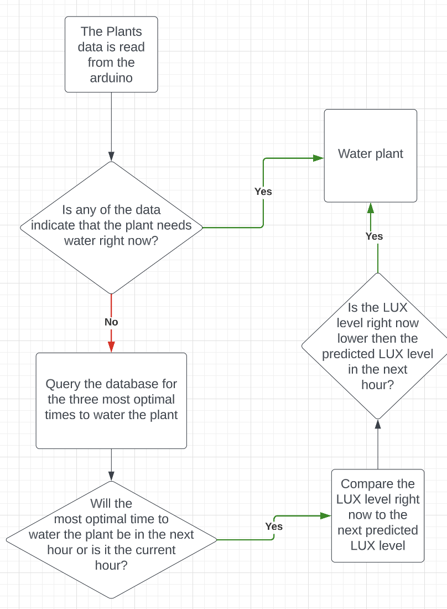

<a name="readme-top"></a>
[![Contributors][contributors-shield]][contributors-url]
[![Forks][forks-shield]][forks-url]
[![Stargazers][stars-shield]][stars-url]
[![Issues][issues-shield]][issues-url]


<!-- PROJECT LOGO -->
<br />
<div align="center">

  <h3 align="center">Plant Life Monitor</h3>

  <p align="center">
    These are the files for a small plant life monitor project
    <br />
    <a href="https://github.com/AnthonyBebek/PlantLifeMonitor"><strong>Explore the docs »</strong></a>
    <br />
    <br />
    <a href="https://github.com/AnthonyBebek/PlantLifeMonitor">View Demo</a>
    ·
    <a href="https://github.com/AnthonyBebek/PlantLifeMonitor/issues">Report Bug</a>
    ·
    <a href="https://github.com/AnthonyBebek/PlantLifeMonitor/issues">Request Feature</a>
  </p>
</div>


<!-- TABLE OF CONTENTS -->
<details>
  <summary>Table of Contents</summary>
  <ol>
    <li>
      <a href="#about-the-project">About The Project</a>
      <ul>
        <li><a href="#What-Do-I-Need?">What Do I Need</a></li>
        <li><a href="#built-with">Built With</a></li>
      </ul>
    </li>
    <li>
      <a href="#getting-started">Getting Started</a>
      <ul>
        <li><a href="#prerequisites">Prerequisites</a></li>
        <li><a href="#installation">Installation</a></li>
      </ul>
    </li>
    <li><a href="#Circut Diagram">Circut Diagram</a></li>
    <li><a href="#Flow Chart and Supporting Documents">Flow Chart and Supporting Documents</a></li>
    <li><a href="#Webpage">Webpage</a></li>
    <li><a href="#contributing">Contributing</a></li>
    <li><a href="#contact">Contact</a></li>
  </ol>
</details>


<!-- ABOUT THE PROJECT -->
## About The Project

These are the files needed to create your own plant life monitor system.

### What Do I Need?
* 1x <a href="https://store-usa.arduino.cc/?selectedStore=us">Arduino UNO</a>
* 1x <a href="https://www.aliexpress.com/item/32898826601.html?aff_fcid=fcff6904473640c4bb0aed1afde8ad6e-1710336244977-03793-e3mYvyk&aff_fsk=e3mYvyk&aff_platform=product&sk=e3mYvyk&aff_trace_key=fcff6904473640c4bb0aed1afde8ad6e-1710336244977-03793-e3mYvyk&terminal_id=6aa137df24334048a6d6fd69880f2bd9">5V Water Pump </a>
* 1x <a href="https://www.jaycar.com.au/arduino-compatible-5v-relay/p/XC4419">5V Relay</a>
* 1x <a href="https://www.jaycar.com.au/duinotech-arduino-compatible-soil-moisture-sensor-module/p/XC4604?pos=1&queryId=988ffabb9c984ec1a0c1612edee84f14">Soil Moisture Sensor</a>
* 1x <a href="https://core-electronics.com.au/dht11-temperature-and-relative-humidity-sensor-module.html">Temperature Sensor (DH11)</a>
* 1x <a href="https://www.jaycar.com.au/10k-epoxy-dip-ntc-thermistor/p/RN3440?pos=1&queryId=ba1f7c9d40641b6579caabf872f55e28&sort=relevance&searchText=thermistor">Thermistor</a>
* 1x <a href="https://www.jaycar.com.au/small-light-dependent-resistor-ldr/p/RD3480?pos=1&queryId=8de7b317c0a30a73d77fa5e68c9f82db&sort=relevance&searchText=LDR">LDR</a>
* Wiring
* Breadboard
* Diodes 
* Resistors (1K)
* NPN Transistor (2N222 Recommended)
* Raspberry Pi (3/4/400/5 Any Model) (3 Recommended)
* 1x <a href="https://www.jbhifi.com.au/products/hp-320-full-hd-webcam?ab_version=A&srsltid=AfmBOopzhGPslyLP9vxwdudkUB63rPnzDr5D8J1onyJ-u3nVqyI-CxxAyaU">USB Camera (Any works)</a>


<p align="right">(<a href="#readme-top">back to top</a>)</p>


### Built With

This project was built with

* 
* 
* 
* 
* 

<p align="right">(<a href="#readme-top">back to top</a>)</p>

<!-- GETTING STARTED -->
### Main Contributiors

Anthony Bebek  
* [![LinkedIn][linkedin-shield]](https://www.linkedin.com/in/anthony-bebek-52b30a2b7/)

<!-- GETTING STARTED -->

## Getting Started


### Prerequisites

Run these commands before running anything else
```sh
sudo apt-get install software-properties-common
sudo add-apt-repository ppa:deadsnakes/ppa
sudo apt-get update
```

* Python
  ```sh
  sudo apt-get install python3.8
  ```

* Git
  ```sh
  sudo apt install git
  ```

* MariaDB
  ```sh
  sudo apt install mariadb-server
  ```


* Apache
  ```sh
  sudo apt install apache2
  ```

### Installation

This installation process assumes that you have a basic raspbarian installation on your raspberry Pi. All linux commands happen on the Pi.

1. Setup MariaDB
    ``` sh
    sudo mysql_secure_installation
    ```
    Start the server with
    ``` sh
    sudo systemctl start mariadb.service
    ```
    Now setup the root account
    ``` sh
    sudo mariadb
    GRANT ALL ON *.* TO 'admin'@'localhost' IDENTIFIED BY '{Your Passowrd}' WITH GRANT OPTION;
    FLUSH PRIVILEGES;
    exit
    ```
    Check if mariadb is configured correctly
    ``` sh
    sudo systemctl status mariadb
    ```

2. Install python imports
    ``` sh
    python3 -m pip install pyserial
    python3 -m pip install chartjs
    python3 -m pip install croniter
    ```

3. Create the website folder
    ``` sh
    mkdir Website
    git clone https://github.com/AnthonyBebek/PlantLifeMonitor
    ```
    run the website with
    ``` sh
    python3 application.py
    ```

    Navigate to http://localhost to see the webpage

    If there is an error in the script, the website doesn't show up or you see the default apache page. Report the issue here  <a href="https://github.com/AnthonyBebek/PlantLifeMonitor/issues">Report Bug</a>

    If you are still having issues with everything, try using the prebuilt OS instead. Which can be
    <a href="https://drive.google.com/file/d/1BN1muYDiF5sIKCxGLZ_ClekoyyZy8rxy/view?usp=share_link"> Found Here </a>

<p align="right">(<a href="#readme-top">back to top</a>)</p>


<!-- USAGE EXAMPLES -->
## Circut Diagram

Running the server is half the project, here is the circut diagram for the physical part.


Here is the circut diagram in another form


<p align="right">(<a href="#readme-top">back to top</a>)</p>

## Flow Chart and Supporting Documents

Here is the flow chart the system uses to determin when to water the plant


Heres a drawing on how the different files internconnect


<p align="right">(<a href="#readme-top">back to top</a>)</p>

## Webpage

This is a photo of the webpage during development


See the [open issues](https://github.com/AnthonyBebek/PlantLifeMonitor/issues) for a full list of proposed features (and known issues).

<p align="right">(<a href="#readme-top">back to top</a>)</p>


<!-- CONTRIBUTING -->
## Contributing

Contributions are what make the open source community such an amazing place to learn, inspire, and create. Any contributions you make are **greatly appreciated**.

If you have a suggestion that would make this better, please fork the repo and create a pull request. You can also simply open an issue with the tag "enhancement".
Don't forget to give the project a star! Thanks again!

1. Fork the Project
2. Create your Feature Branch (`git checkout -b feature/AmazingFeature`)
3. Commit your Changes (`git commit -m 'Add some AmazingFeature'`)
4. Push to the Branch (`git push origin feature/AmazingFeature`)
5. Open a Pull Request

<p align="right">(<a href="#readme-top">back to top</a>)</p>


<!-- CONTACT -->
## Contact

Anthony Bebek - ante@viagi.com
* [![LinkedIn][linkedin-shield]](https://www.linkedin.com/in/anthony-bebek-52b30a2b7/)

Project Link: [https://github.com/AnthonyBebek/PlantLifeMonitor](https://github.com/AnthonyBebek/PlantLifeMonitor)

<p align="right">(<a href="#readme-top">back to top</a>)</p>

<!-- MARKDOWN LINKS & IMAGES -->
<!-- https://www.markdownguide.org/basic-syntax/#reference-style-links -->
[contributors-shield]: https://img.shields.io/github/contributors/AnthonyBebek/PlantLifeMonitor.svg?style=for-the-badge
[contributors-url]: https://github.com/AnthonyBebek/PlantLifeMonitor/graphs/contributors
[forks-shield]: https://img.shields.io/github/forks/AnthonyBebek/PlantLifeMonitor.svg?style=for-the-badge
[forks-url]: https://github.com/AnthonyBebek/PlantLifeMonitor/network/members
[stars-shield]: https://img.shields.io/github/stars/AnthonyBebek/PlantLifeMonitor.svg?style=for-the-badge
[stars-url]: https://github.com/AnthonyBebek/PlantLifeMonitor/stargazers
[issues-shield]: https://img.shields.io/github/issues/AnthonyBebek/PlantLifeMonitor.svg?style=for-the-badge
[issues-url]: https://github.com/AnthonyBebek/PlantLifeMonitor/issues
[license-shield]: https://img.shields.io/github/license/AnthonyBebek/PlantLifeMonitor.svg?style=for-the-badge
[license-url]: https://github.com/AnthonyBebek/PlantLifeMonitor/blob/master/LICENSE.txt
[linkedin-shield]: https://img.shields.io/badge/-LinkedIn-black.svg?style=for-the-badge&logo=linkedin&colorB=555
[linkedin-url]: https://linkedin.com/in/linkedin_username
[product-screenshot]: images/screenshot.png
[Next.js]: https://img.shields.io/badge/next.js-000000?style=for-the-badge&logo=nextdotjs&logoColor=white
[Next-url]: https://nextjs.org/
[React.js]: https://img.shields.io/badge/React-20232A?style=for-the-badge&logo=react&logoColor=61DAFB
[React-url]: https://reactjs.org/
[Vue.js]: https://img.shields.io/badge/Vue.js-35495E?style=for-the-badge&logo=vuedotjs&logoColor=4FC08D
[Vue-url]: https://vuejs.org/
[Angular.io]: https://img.shields.io/badge/Angular-DD0031?style=for-the-badge&logo=angular&logoColor=white
[Angular-url]: https://angular.io/
[Svelte.dev]: https://img.shields.io/badge/Svelte-4A4A55?style=for-the-badge&logo=svelte&logoColor=FF3E00
[Svelte-url]: https://svelte.dev/
[Laravel.com]: https://img.shields.io/badge/Laravel-FF2D20?style=for-the-badge&logo=laravel&logoColor=white
[Laravel-url]: https://laravel.com
[Bootstrap.com]: https://img.shields.io/badge/Bootstrap-563D7C?style=for-the-badge&logo=bootstrap&logoColor=white
[Bootstrap-url]: https://getbootstrap.com
[JQuery.com]: https://img.shields.io/badge/jQuery-0769AD?style=for-the-badge&logo=jquery&logoColor=white
[JQuery-url]: https://jquery.com 
[Repo-url]: https://github.com/AnthonyBebek/PlantLifeMonitor
